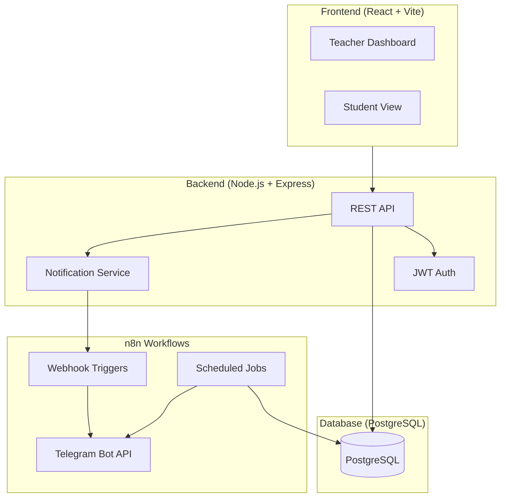
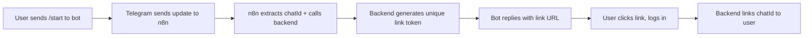
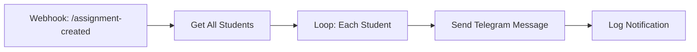
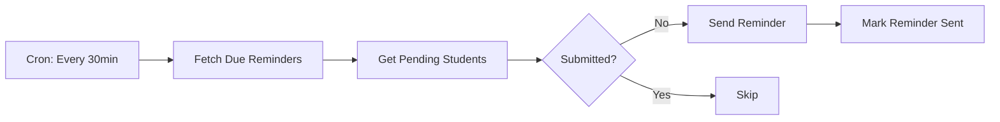
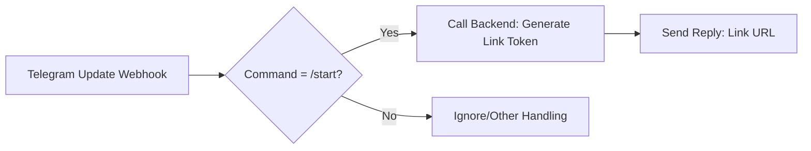
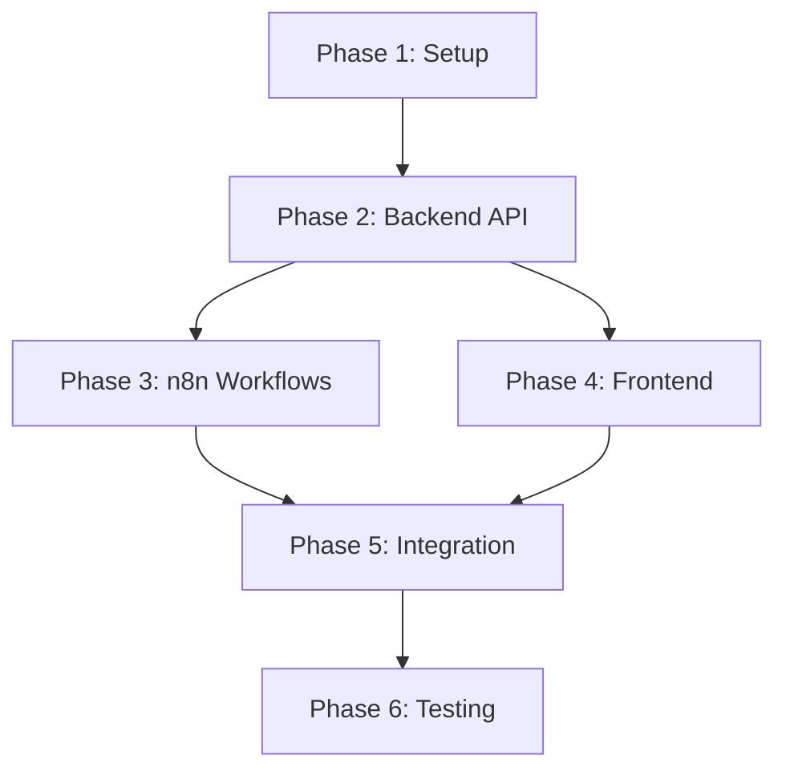

# Automated Classwork Assignment & Reminder System - Implementation Plan

A full-stack system for teachers to create assignments with automated notifications and reminders via Telegram (MVP), designed for future WhatsApp migration.

---

## System Architecture Overview



---

## Tech Stack Decisions

| Layer | Technology | Rationale |
|-------|------------|-----------|
| Frontend | React + Vite | Fast dev experience, component-based |
| Styling | Vanilla CSS / CSS Modules | Per project guidelines |
| Backend | Node.js + Express | JavaScript ecosystem consistency |
| Database | PostgreSQL | Relational data, robust scheduling |
| ORM | Prisma | Type-safe, excellent DX |
| Auth | JWT + bcrypt | Stateless, scalable |
| Automation | n8n (self-hosted) | Visual workflows, webhook support |
| Messaging MVP | Telegram Bot API | Free, easy setup |
| Future Messaging | WhatsApp Business Cloud API | Drop-in via abstraction layer |

---

## Phase 1: Project Setup & Database

### Task 1.1: Initialize Project Structure

#### [NEW] Project Root Structure
```
classwork-system/
├── backend/
│   ├── src/
│   │   ├── controllers/
│   │   ├── middleware/
│   │   ├── models/
│   │   ├── routes/
│   │   ├── services/
│   │   └── utils/
│   ├── prisma/
│   └── package.json
├── frontend/
│   ├── src/
│   │   ├── components/
│   │   ├── pages/
│   │   ├── services/
│   │   └── context/
│   └── package.json
└── n8n-workflows/
    └── *.json
```

**Steps:**
1. Create `classwork-system` directory in `C:\Users\USER\.gemini\antigravity\scratch\`
2. Initialize backend with `npm init -y`
3. Initialize frontend with `npx -y create-vite@latest ./ --template react`
4. Install backend dependencies: `express`, `prisma`, `@prisma/client`, `jsonwebtoken`, `bcryptjs`, `cors`, `dotenv`, `node-cron`, `axios`
5. Install frontend dependencies: `axios`, `react-router-dom`, `recharts`

**Validation:**
- [ ] Both `package.json` files exist and have correct dependencies
- [ ] `npm install` runs without errors in both directories

---

### Task 1.2: Database Schema Design

#### [NEW] `backend/prisma/schema.prisma`

Design the following models:

| Model | Fields | Purpose |
|-------|--------|---------|
| `User` | id, email, password, name, role (TEACHER/STUDENT), telegramChatId, telegramLinked, createdAt | User authentication & messaging |
| `Assignment` | id, title, description, dueDate, createdById, createdAt, updatedAt | Assignment data |
| `Reminder` | id, assignmentId, reminderTime, type (24H/2H/CUSTOM), sent | Reminder scheduling |
| `Submission` | id, assignmentId, studentId, status (PENDING/SUBMITTED/LATE), submittedAt | Track submissions |
| `NotificationLog` | id, userId, assignmentId, channel, status, sentAt, errorMessage | Audit trail |

**Relationships:**
- Assignment → User (createdBy)
- Reminder → Assignment
- Submission → Assignment, User
- NotificationLog → User, Assignment

**Steps:**
1. Create `schema.prisma` with above models
2. Run `npx prisma migrate dev --name init`
3. Generate Prisma client

**Validation:**
- [ ] Migration creates all tables successfully
- [ ] `npx prisma studio` shows correct schema

---

## Phase 2: Backend API Development

### Task 2.1: Authentication System

#### [NEW] `backend/src/middleware/auth.js`
- JWT verification middleware
- Role extraction from token

#### [NEW] `backend/src/controllers/authController.js`
- `POST /api/auth/register` - Create user with hashed password
- `POST /api/auth/login` - Validate credentials, return JWT
- `GET /api/auth/me` - Get current user profile

#### [NEW] `backend/src/routes/authRoutes.js`
- Route definitions for auth endpoints

**Validation:**
- [ ] Register creates user in database
- [ ] Login returns valid JWT
- [ ] Protected routes reject invalid tokens

---

### Task 2.2: Assignment CRUD API

#### [NEW] `backend/src/controllers/assignmentController.js`

| Endpoint | Method | Auth | Description |
|----------|--------|------|-------------|
| `/api/assignments` | GET | All | List assignments (filtered by role) |
| `/api/assignments/:id` | GET | All | Get single assignment |
| `/api/assignments` | POST | Teacher | Create assignment + auto-reminders |
| `/api/assignments/:id` | PUT | Teacher | Update assignment |
| `/api/assignments/:id` | DELETE | Teacher | Delete assignment |

**Business Logic:**
- On CREATE: Auto-generate 24h and 2h reminders based on dueDate
- On CREATE: Trigger notification webhook to n8n
- On UPDATE: Recalculate reminder times if dueDate changed

#### [NEW] `backend/src/routes/assignmentRoutes.js`

**Validation:**
- [ ] Teachers can CRUD assignments
- [ ] Students can only GET assignments
- [ ] Reminders auto-created on assignment creation

---

### Task 2.3: Submission Tracking API

#### [NEW] `backend/src/controllers/submissionController.js`

| Endpoint | Method | Auth | Description |
|----------|--------|------|-------------|
| `/api/submissions` | GET | Teacher | List all submissions (with filters) |
| `/api/submissions/assignment/:id` | GET | Teacher | Submissions for specific assignment |
| `/api/submissions/:assignmentId` | POST | Student | Submit work |
| `/api/submissions/my` | GET | Student | Student's own submissions |

**Business Logic:**
- Auto-set status to `LATE` if submitted after dueDate
- Create `PENDING` submission entries for all students when assignment created

#### [NEW] `backend/src/routes/submissionRoutes.js`

**Validation:**
- [ ] Students can submit work
- [ ] Late submissions marked correctly
- [ ] Teachers see all submissions with status

---

### Task 2.4: Notification Service Abstraction

> [!IMPORTANT]
> This is the key abstraction layer enabling future WhatsApp migration

#### [NEW] `backend/src/services/notifications/NotificationChannel.js`
```
Interface/Base Class:
- sendMessage(userId, message): Promise<boolean>
- getName(): string
```

#### [NEW] `backend/src/services/notifications/TelegramChannel.js`
- Implements NotificationChannel
- Uses Telegram Bot API
- Reads `telegramChatId` from User

#### [NEW] `backend/src/services/notifications/NotificationService.js`
- Channel registry pattern
- `registerChannel(channel)`
- `send(userId, message, channelName?)`
- Logs all notifications to `NotificationLog`

#### [NEW] `backend/src/services/notifications/WhatsAppChannel.js` (Stub)
- Placeholder implementation for future migration
- Same interface as TelegramChannel

**Validation:**
- [ ] Telegram messages send successfully
- [ ] All notifications logged in database
- [ ] WhatsApp stub can be swapped in without code changes

---

### Task 2.5: Webhook Endpoints for n8n

#### [NEW] `backend/src/controllers/webhookController.js`

| Endpoint | Method | Description |
|----------|--------|-------------|
| `/api/webhooks/pending-students/:assignmentId` | GET | Get students who haven't submitted |
| `/api/webhooks/due-reminders` | GET | Get reminders due in next hour |
| `/api/webhooks/log-notification` | POST | Log notification from n8n |

#### [NEW] `backend/src/routes/webhookRoutes.js`

**Validation:**
- [ ] Pending students endpoint returns correct list
- [ ] Due reminders filtered by time window

---

### Task 2.6: Telegram Bot Linking (/start Command)

> [!TIP]
> This replaces manual telegramChatId entry with automatic linking via the bot.

#### [NEW] `backend/src/controllers/telegramController.js`

**Flow:**


| Endpoint | Method | Description |
|----------|--------|-------------|
| `/api/telegram/link-token` | POST | Generate time-limited token for linking |
| `/api/telegram/link` | POST | Link chatId to authenticated user via token |
| `/api/telegram/webhook` | POST | Receive Telegram bot updates (or via n8n) |

**Implementation:**
1. User sends `/start` to Telegram bot
2. n8n receives update, calls backend with chatId
3. Backend generates unique token (valid 10 mins), stores in Redis/DB
4. Bot replies: "Link your account: https://app.example.com/link-telegram?token=xxx"
5. User clicks link, authenticates (login if needed)
6. Frontend calls `/api/telegram/link` with token
7. Backend validates token, links chatId to logged-in user

#### [NEW] `frontend/src/pages/LinkTelegram.jsx`
- Receives token from URL params
- Shows "Link Telegram Account" button
- Calls API to complete linking
- Success/error feedback

**Validation:**
- [ ] /start command generates link
- [ ] Expired tokens rejected
- [ ] User can unlink and relink
- [ ] Multiple users can't link same chatId

---

## Phase 3: n8n Workflow Integration

### Task 3.1: New Assignment Notification Workflow

#### [NEW] `n8n-workflows/new-assignment-notification.json`



**Trigger:** Backend webhook on assignment creation
**Action:** Send Telegram message to all students

---

### Task 3.2: Scheduled Reminder Workflow

#### [NEW] `n8n-workflows/scheduled-reminders.json`



**Logic:**
- Only send to students with `PENDING` status
- Mark reminder as `sent: true` after sending

---

### Task 3.3: n8n Setup Documentation

#### [NEW] `n8n-workflows/README.md`
- Installation steps for n8n
- Telegram Bot setup guide (BotFather)
- **Bot webhook setup for /start command**
- Workflow import instructions
- Environment variables needed

---

### Task 3.4: Telegram /start Handler Workflow

#### [NEW] `n8n-workflows/telegram-start-handler.json`



**Setup:**
1. Set Telegram bot webhook to n8n endpoint
2. n8n parses incoming updates
3. Calls backend for link token
4. Replies to user with personalized link

**Validation:**
- [ ] n8n workflows import successfully
- [ ] Test assignment triggers notification
- [ ] Reminders send at correct times
- [ ] Submitted students not reminded

---

## Phase 4: Frontend - Teacher Dashboard

### Task 4.1: Authentication Pages

#### [NEW] `frontend/src/pages/Login.jsx`
- Email/password form
- JWT storage in localStorage
- Redirect based on role

#### [NEW] `frontend/src/pages/Register.jsx`
- Registration form with role selection
- No manual Telegram ID needed (linked via /start command)

#### [NEW] `frontend/src/context/AuthContext.jsx`
- Auth state management
- Login/logout functions
- Role-based access helpers

**Validation:**
- [ ] Login redirects to correct dashboard
- [ ] Invalid credentials show error
- [ ] Logout clears token

---

### Task 4.2: Assignment Management UI

#### [NEW] `frontend/src/pages/teacher/AssignmentList.jsx`
- Table/card view of all assignments
- Status badges (Active/Past Due)
- Quick actions (Edit/Delete/View Submissions)

#### [NEW] `frontend/src/pages/teacher/AssignmentForm.jsx`
- Create/Edit assignment form
- Title, Description (rich text optional), Due Date picker
- Custom reminder time inputs

#### [NEW] `frontend/src/components/AssignmentCard.jsx`
- Reusable assignment display component

**Validation:**
- [ ] Create assignment appears in list
- [ ] Edit updates correctly
- [ ] Delete removes with confirmation

---

### Task 4.3: Submission Dashboard

#### [NEW] `frontend/src/pages/teacher/SubmissionDashboard.jsx`

| Feature | Description |
|---------|-------------|
| Assignment Selector | Dropdown to pick assignment |
| Stats Summary | Total/Submitted/Pending/Late counts |
| Defaulter List | Students with PENDING status |
| Status Chart | Pie chart via Recharts |

#### [NEW] `frontend/src/components/DefaulterList.jsx`
- Filterable table of pending students
- Last notified timestamp
- Manual remind button

#### [NEW] `frontend/src/components/SubmissionChart.jsx`
- Pie/donut chart: Submitted vs Pending vs Late
- Uses Recharts library

**Validation:**
- [ ] Stats update when submission status changes
- [ ] Defaulter list accurate
- [ ] Chart renders correctly

---

### Task 4.4: Student View

#### [NEW] `frontend/src/pages/student/MyAssignments.jsx`
- List of assigned work
- Due date countdown
- Submission status badge

#### [NEW] `frontend/src/pages/student/SubmitWork.jsx`
- Simple submission form
- Text/link input for now
- Confirmation message

**Validation:**
- [ ] Student sees only their assignments
- [ ] Submission updates status immediately

---

## Phase 5: Integration & Polish

### Task 5.1: API Integration Layer

#### [NEW] `frontend/src/services/api.js`
- Axios instance with base URL
- JWT interceptor for auth header
- Error handling wrapper

#### [NEW] `frontend/src/services/assignmentService.js`
#### [NEW] `frontend/src/services/submissionService.js`
#### [NEW] `frontend/src/services/authService.js`

---

### Task 5.2: Protected Routes

#### [MODIFY] `frontend/src/App.jsx`
- React Router setup
- Route guards by role
- 404 page

---

### Task 5.3: Environment Configuration

#### [NEW] `backend/.env.example`
```
DATABASE_URL=postgresql://...
JWT_SECRET=...
TELEGRAM_BOT_TOKEN=...
N8N_WEBHOOK_URL=...
```

#### [NEW] `frontend/.env.example`
```
VITE_API_URL=http://localhost:3001/api
```

---

## Phase 6: Validation & Testing Strategy

### Automated Tests

| Test Type | Location | Command |
|-----------|----------|---------|
| API Unit Tests | `backend/tests/*.test.js` | `npm test` |
| Auth Flow Test | `backend/tests/auth.test.js` | `npm test -- auth` |
| Assignment CRUD | `backend/tests/assignment.test.js` | `npm test -- assignment` |

**Testing Framework:** Jest + Supertest

**Key Test Cases:**
1. User registration with valid data
2. Login returns JWT
3. Protected route blocks unauthenticated
4. Teacher can create assignment
5. Student cannot create assignment
6. Submission status transitions correctly
7. Webhook returns pending students only

---

### Manual Validation Checklist

#### Auth Flow
1. Open `http://localhost:5173`
2. Register as Teacher → Verify redirect to dashboard
3. Logout → Login again → Verify session persists
4. Register as Student → Verify different dashboard

#### Assignment Flow
1. As Teacher: Create new assignment with due date tomorrow
2. Verify assignment appears in list
3. Check database for auto-created reminders
4. Check n8n execution log for webhook trigger

#### Notification Flow
1. Ensure Telegram bot is configured
2. Create assignment → Student should receive Telegram message
3. Wait for reminder time → Verify reminder sent
4. Student submits → Verify no further reminders

#### Submission Tracking
1. As Student: Submit assignment
2. As Teacher: View submission dashboard
3. Verify status shows SUBMITTED
4. Check defaulter list excludes submitted student

---

## Dependency Graph



> [!NOTE]
> Phases 3 and 4 can be worked on in parallel after Phase 2 is complete.

---

## Future Migration Path: Telegram → WhatsApp

1. Create `WhatsAppChannel.js` implementing `NotificationChannel` interface
2. Add WhatsApp credentials to `.env`
3. Register WhatsApp channel in `NotificationService`
4. Update user model to store WhatsApp phone numbers
5. Switch default channel or add user preference
6. Update n8n workflows if needed (or use backend for all sending)

> [!TIP]
> The abstraction layer means zero changes to controllers or business logic—only the notification channel implementation changes.

---

## Estimated Timeline

| Phase | Duration | Parallel? |
|-------|----------|-----------|
| Phase 1: Setup | 1 day | No |
| Phase 2: Backend | 3-4 days | No |
| Phase 3: n8n | 1-2 days | Yes (with P4) |
| Phase 4: Frontend | 3-4 days | Yes (with P3) |
| Phase 5: Integration | 1-2 days | No |
| Phase 6: Testing | 1-2 days | No |

**Total Estimated Time: 10-14 days**
