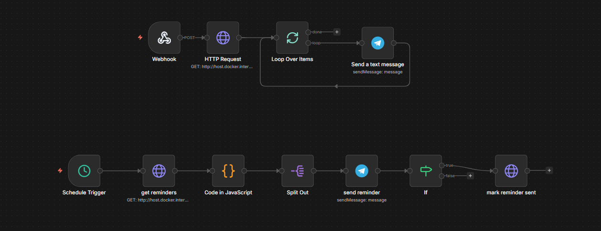
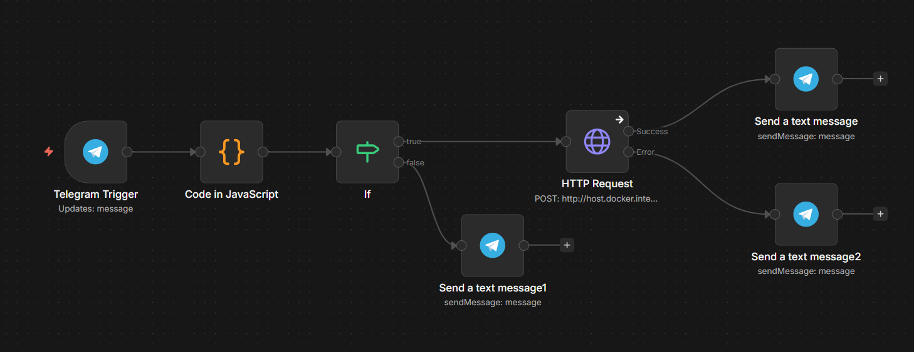

# n8n Workflows

This folder contains exported n8n workflows so the automation logic is versioned in Git.

## Assignment + Reminders Workflow

- File: `assignment-and-reminders.json`
- Branch 1 (Webhook): sends new-assignment Telegram notifications to all telegram-linked students.
- Branch 2 (Schedule Trigger): polls due reminders and sends reminder messages, then marks reminders as sent.

### Screenshot

## Telegram /start Linking Workflow

- File: `telegram-start-linking.json`
- Trigger: Listens for `/start <token>` messages from Telegram users
- Logic:
  1. Extracts token and chat ID from message
  2. Validates token format
  3. Calls backend `POST /api/telegram/link` with token and chatId
  4. Routes based on success/error:
     - **Success**: sends ✅ confirmation message
     - **Missing token**: sends ❌ error message
     - **Errors** (expired, already linked, invalid): sends user-friendly error messages based on backend error classification

### Screenshot

### Error Handling

The workflow includes smart error branching with user-friendly messages:
- "already linked" → ⚠️ This Telegram account is already linked to another user.
- "expired" → ⌛ Token expired. Please generate a fresh link in the app.
- "Invalid or used" → ❌ This token is invalid or already used.

### Required Backend Endpoints

- `POST /api/telegram/link` - Links Telegram chatId to user account

### Configuration

- Replace credentials with your Telegram bot token
- Update webhook ID if needed
- URL uses `host.docker.internal:3001` for local development

## Notes

- Workflow JSON is sanitized (credentials and instance metadata removed).
- Required backend endpoints:
  - GET `/api/users/telegram-linked`
  - GET `/api/reminders/due-soon`
  - POST `/api/reminders/:id/mark-sent`
- Required environment variables:
  - `N8N_WEBHOOK_URL`
