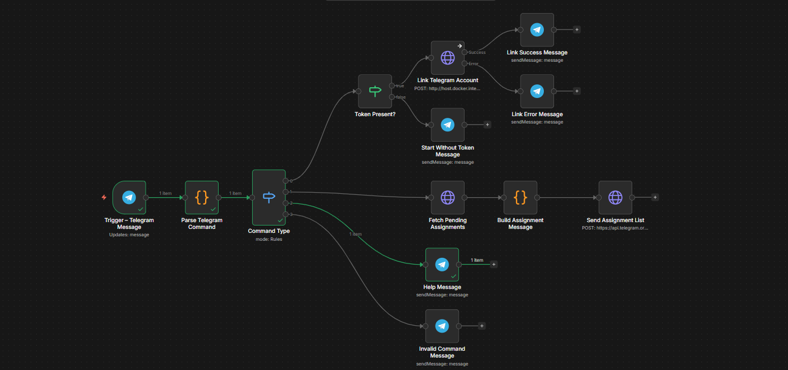
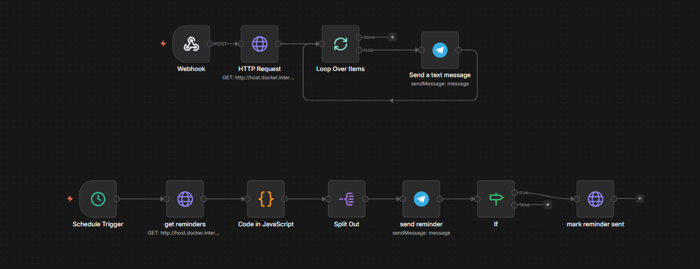

# n8n Workflows

This folder contains exported n8n workflows so the automation logic is versioned in Git.
All workflow JSONs are sanitized (credentials and instance metadata removed).

---

## 1. Telegram Command Router

- **File**: `Telegram Command Router.json`
- **Trigger**: Single Telegram Trigger listening for all incoming messages
- **Replaces**: the old `Telegram Assignments Workflow.json` and `telegram-start-linking.json` (merged to avoid webhook conflicts — Telegram allows only one webhook per bot)

### Flow

```
Telegram Message → Parse Command → Switch (commandType)
  ├── /start <token>  → Token present? → Link Telegram Account → Success / Error reply
  ├── /start (no token) → Welcome message with instructions
  ├── /assignments    → Fetch Pending → Build Message → Send Assignment List
  ├── /help           → Help Message
  └── default         → Invalid Command Message
```

### Supported Commands

| Command | Description |
|---|---|
| `/start <token>` | Link Telegram account using token from the app |
| `/assignments` | View pending assignments with submit buttons |
| `/help` | Show available commands |

### Error Handling (Linking)

| Backend Error | User Message |
|---|---|
| `already linked` | ⚠️ This Telegram account is already linked to another user. |
| `expired` | ⌛ Token expired. Please generate a fresh link in the app. |
| `Invalid or used` | ❌ This token is invalid or already used. |

### Screenshot



### Required Backend Endpoints

- `POST /api/telegram/link` — Links Telegram chatId to user account
- `GET /api/assignments/pending-by-chat/:chatId` — Pending assignments for a chat

### Configuration

- Replace Telegram bot credentials with your own
- Update `baseUrl` in the "Build Assignment Message" code node to your app's public URL
- Backend URL defaults to `http://host.docker.internal:3001` for local Docker setups

---

## 2. Assignment Notifications + Reminders

- **File**: `assignment-and-reminders.json`
- **Branch 1** (Webhook `POST /assignment-created`): Sends new-assignment Telegram notifications to all linked students
- **Branch 2** (Schedule Trigger, every minute): Polls due reminders and sends reminder messages, then marks them as sent

### Screenshot



### Required Backend Endpoints

- `GET /api/users/telegram-linked` — All students with linked Telegram accounts
- `GET /api/reminders/due-soon` — Reminders that should be sent now
- `POST /api/reminders/:id/mark-sent` — Mark a reminder as sent

---

## Notes

- All credentials and webhook IDs in the JSON files use `YOUR_*` placeholders
- Required environment variable: `N8N_WEBHOOK_URL`
